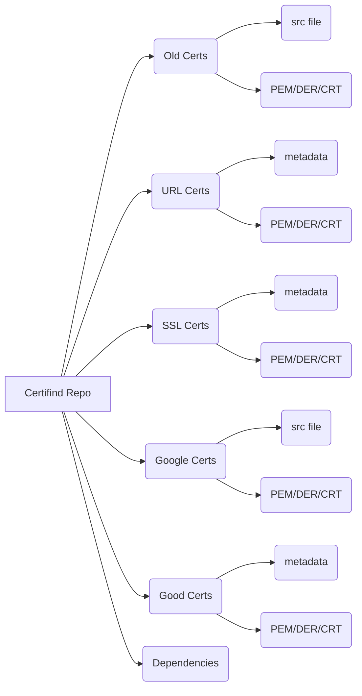

<br/>
<p align="center">
  <h3 align="center">CertiFind</h3>

  <p align="center">
    An python script which gives an easy CLI tool to get TLS/SSL certificate data as well as a repoistory of TLS/SSL certificates
    <br/>
    <br/>
  </p>
</p>

   

## Table Of Contents

 * [About the Project](#about-the-project)
 * [Getting Started](#getting-started)
 * [Prerequisites](#prerequisites)
 * [Installation](#installation)
 * [Usage](#usage)
	* [Certifind](#certifind)
	* [Convert](#convert)
	* [Checked](#checked)
	* [Extension](#extension)
	* [Arguments](#arguments)
	* [Tests](#tests)
 * [Certificates](#certificates)
 * [Troubleshooting](#troubleshooting)
 * [Roadmap](#roadmap)
 * [License](#license)
 * [Authors](#authors)
 * [Acknowledgements](#acknowledgements)

## About The Project

This project has a few different scripts with different functions. The first script (certifind.py) has two main functions to either get the TLS/SSL certificate of a website or to get the TLS/SSL certificate associated with a HASH value. 

For both functions a text document containing either URLs or HASH values (SHA1) is passed into the script and the script will automatically either get the certificates of the list provided. 

The other script (convert_file.py) provides an easy CLI to convert certificate data from and to CRT, DER, or PEM.

This repository also has 1000+ malicious certificates and 5000+ benign certificates for the purpose of research. 

If the websites that CertiFind (crt.sh and abuse.ch) depend on change the names within the html pages, this program will likely break.

## Getting Started

### Prerequisites

CertiFind depends was developed using these softwares:
- [Python](https://www.python.org/downloads/) 3.10.9
- [Selenium](https://pypi.org/project/selenium/) 4.9.1
- [Pysan1](https://pypi.org/project/pyasn1/) 0.4.8
- [Pysan1-Modules](https://pypi.org/project/pyasn1-modules/) 0.2.8
- [OpenSSL](https://pypi.org/project/pyOpenSSL/) 23.0.0
- [Google Chrome](https://www.google.com/intl/en_au/chrome/) 113.0.5672
- [ChromeDriver](https://chromedriver.chromium.org/downloads) matching version above


### Installation

1. Clone the repo

```sh
git clone https://github.com/DBobsRepo/CertiFind.git
```

2. Install dependencies

a.  Python through [Conda](https://www.anaconda.com/download) or [Python](https://www.python.org/downloads/)

b. Selenium 
```sh
# Using pip
pip install selenium

# Using conda
conda install -c conda-forge selenium
```
c.  Pysan1
```sh
# Using pip
pip install pyasn1

# Using conda
conda install -c conda-forge pyasn1
```
d. Pysan1-Modules
```sh
# Using pip
pip install pyasn1-modules

# Using conda
conda install -c conda-forge pyasn1-modules
```
e. OpenSSL
```sh
# Using pip
pip install pyOpenSSL

# Using conda
conda install -c anaconda openssl
```
f. [Google Chrome](https://www.google.com/intl/en_au/chrome/)

g. [ChromeDriver](https://chromedriver.chromium.org/downloads)

(Ensure that ChromeDriver is the same version as the Google Chrome you have installed)
	
3. Ready for use
 
## Usage

### Certifind
Queries hashes or urls and get their certificate
```bash
# To see possible arguments
python certifind.py --help

# To use URL feature
python certifind.py url -o ./output_directory [other arguments]

# To use SSL feature
python certifind.py ssl -o ./output_directory [other arguments]

```
### Convert
Converts a certificate from CRT/DER/PEM to CRT/DER/PEM
```bash
# To see possible arguments
python convert_cert.py --help

# To use convert certificates
python convert_cert.py -t PEM -f DER -i ./input_directory -o ./output_directory
```
### Checked
Finds values which successfully returned a certificate, values did not successfully return a certificate but should have, and what values did not return anything
```bash
# To see possible arguments
python checked.py --help

# To use URL feature (assumes certificate name contains URL)
python checked.py url -hi ./hits_file.txt -c ./checked_file.txt -i ./input_directory -o ./output_directory

# To use SSL feature
python checked.py ssl -hi ./hits_file.txt -c ./checked_file.txt -i ./input_directory -o ./output_directory
```
### Extension
Changes the extension of the file from CRT/DER/PEM to CRT/DER/PEM. Essentially the same as convert.py but does not change the content of the file only the extension
```bash
# To see possible arguments
python change_extension.py --help

# To use change files extensions
python change_extension.py  -t PEM -f DER -i ./input_directory -o ./output_directory
```

### Arguments
#### Certifind.py arguments:

operation (positional) = the operation you would like to do (options are SSL, URL) **required**

\-i or \-\-input = a file containing a list of either URLs or SHA1 HASHES to search for their certificates (if none it will get the data from abuse.ch)

\-c or \-\-checked = a file containing a list of either URLs or SHA1 HASHES of data that has already been queried, to prevent searching for the same certificate twice (if none it will create and store the checked values in a text file)

\-t or \-\-timeout = a positive float number representing the time to wait before moving onto the next value to query (default for SSL = 5 seconds, default for URL = 1 second) 

\-s or \-\-secure = this argument is only applicable for operation URL. If set only secure SSL certificates will be downloaded from the URLs. Default = False

\-v or \-\-verbose = if set will change output mode to debug and print debugging information of URL and SSL operations. Defaul = False

\-o or \-\-output = the output directory to put the downloaded certificates (this must be the last argument specified) (this does not work for ssl operation - all downloads for ssl operation go to the Downloads folder) **required**

Certifind.py will output all successful queries to a file called "hits.txt" - this cannot be changed. This is because occasionally the download takes to long and the program moves onto the next query. So after the program is done, you can compare the number of rows in "hits.txt" to the number of downloaded files using the checked.py file. If there is a difference re-run Certifind.py with the input directory as the "hits.txt" file, this will rerun and download the missing certificates.

#### Convert_cert.py arguments:

\-t or \-\-to = the filetype to convert to (options are PEM, CRT, DER) **required**

\-f or \-\-from = the input filetype, the filetype you are converting from (options are PEM, CRT, DER) **required**

\-i or \-\-input = the input directory to search for certificates (not recursive) **required**

\-o or \-\-output = the output directory to put the converted certificates **required**

#### Checked.py arguments:

\-hi or \-\-hits = a file containing the values which should have been downloaded (this is generated when using certifind.py) **required**

\-c or \-\-checked = a file containing the values which have been checked - regardless of whether they returned a certificate or note  **required**

\-i or \-\-input = the input directory of downloaded certificates (not recursive) **required**

\-o or \-\-output = the output directory to put the metadata (what values returned certificates, what values should have, what values did not) **required**
#### Change_extension.py arguments:

\-t or \-\-to = the extension to change to (options are PEM, CRT, DER) **required**

\-f or \-\-from = the extensions to search for, the extension you are changing from (options are PEM, CRT, DER) **required**

\-i or \-\-input = the input directory to search for certificates (not recursive) **required**

\-o or \-\-output = the output directory to put the converted certificates **required**
</br>
</br>
### Tests
In the file "Tests" is a text document called 'RUN THESE COMMANDS". Running those commands in that directory will perform some tests to ensure the tool is working correctly.

Before running the tests make sure you have installed all prerequisites 

## Certificates
This sections describes the different certificates contained within the repository and the structure of the repo. Metadata includes text documents containing the data used to create the folder (i.e. what URLs were queried to get the Good Certs, what URLs were successful in querying them, etc.)


As seen above there are 6 sections of this repository which are:

 - Dependencies
	 - This section just contains tar files of the dependencies (selenium, pysan, etc. in case they aren't downloadable via pip or conda).
 - Good Certs
	 - This section contains certificates of trustworthy websites (the websites are from [Alexa's top 1 million websites](https://www.kaggle.com/datasets/cheedcheed/top1m), so they can be assumed benign/good certificates). This section contains ~5000 certificates. 
 - Google Certs 
	 - The certificates within this section were downloaded from [here](https://chromium.googlesource.com/chromium/src/+/c77495f99003b06f5e9d6ac750b6ffb0afdb582a/net/data/ssl/blacklist/README.md). The description given there was "a number of certificates and public keys which are considered blacklisted within Chromium-based products." - these certificates were once legitimate certificates which became compromised or hijacked (website has more details). This section contains ~40 certificates.
 - SSL Certs
	 - The SHA1 HASHES used to obtain these certificates within this section were from [SSLBL](https://sslbl.abuse.ch/). These are certificates of C&C servers (so the certificates are likely not real and created by the bad actor). This section contains ~800 certificates.
 - URL Certs
	 - The URLs used to obtain these certificates within this section were from [URLHAUS](https://urlhaus.abuse.ch/). These are certificates of websites which spread malware (so the certificates are likely real but used for bad purposes). **DO NOT GO TO ANY OF THESE URLS** as they contain live malware. Just with [VirusTotal](https://www.virustotal.com/gui/home/search) before accessing any of those websites. This section contains ~400 certificates.
 - Old Certs
	 - The certificates within this section were from [this](https://github.com/lhaagsma/sslblacklist) github repo. This is a repository of certificates from SSLBL back in retrieved back in 2013. This is valuable as querying crt.sh does not always yield a certificate. So this repository gives us certificates from back in those times. This section contains ~250 certificates. 

All sections contain a PEM, DER, and CRT folder containing the certificates in the respective filetypes.
 
## Troubleshooting
If you see this error in an anaconda environment:
```bash
Unable to obtain driver using Selenium Manager: ... 
```
Run these commands:
```bash
conda uninstall selenium
conda install -c conda-forge selenium
```
Then copy the ['windows'](https://github.com/DBobsRepo/CertiFind/tree/main/Dependencies/windows) folder from [Dependencies](https://github.com/DBobsRepo/CertiFind/tree/main/Dependencies) to this directory "path_to_anaconda3/lib/site-packages/selenium/webdriver/common"

## Roadmap
As of now there are no plan to update this repo continually. Running the <span>certifind.py</span> without any parameters (other then output) should get the most recent URL certificates and SSL certificates.

There are some improvement to be made such as changing the way in which querying crt.sh happens. It currently uses selenium, but this could be replaced by an sql query to the postgres database.

## Acknowledgements

* [ShaanCoding](https://github.com/ShaanCoding/) for README file template
* [Ihaagsma](https://github.com/ihaagsma) for old certificate data
* [Crt.sh](https://crt.sh/) for certificate database
* [Abuse.cd](https://abuse.ch/) for URLHAUS and SSLBL
